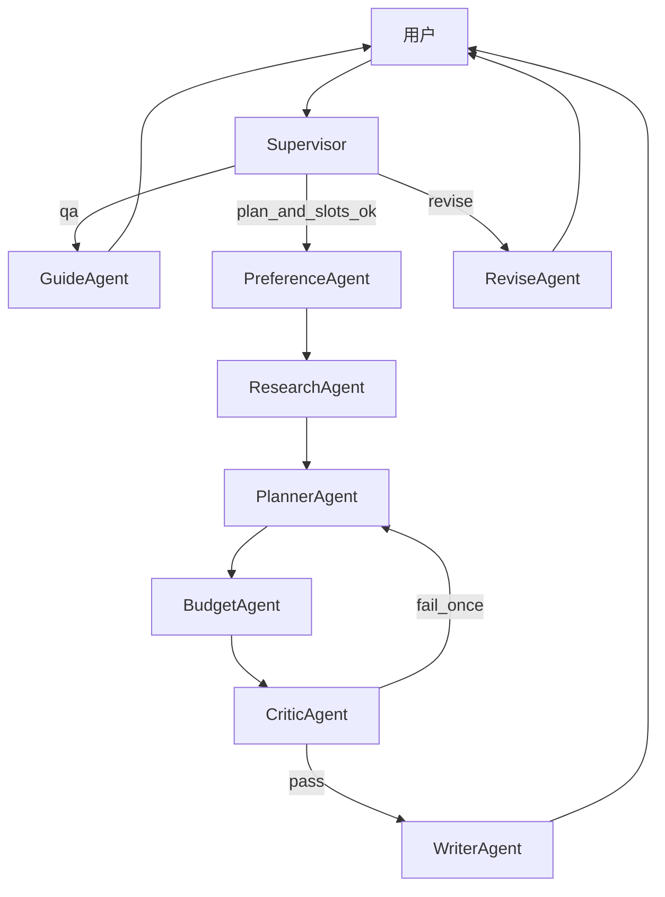

# 多 Agent 协作：旅行规划与方案设计

独立 Python 项目。不修改、不依赖 `zj-agent-service-toolkit`。

## 约束

- 技术栈：FastAPI + LangGraph 后端，Vite + React + TypeScript 前端
- 产品：攻略查询 + 多日方案设计；不做订票
- 主线是多 Agent 协作：Supervisor 调度专家，共享 `TravelState`

## 协作模型

多个专家 Agent 共享一份 `TravelState`，由 Supervisor 决定下一个说话的人。每个专家只写自己负责的字段。

专家职责（终局名单，分期上场）：

- **Supervisor**：判意图 `qa | plan | revise`，检查缺槽，决定调度谁；不写行程
- **GuideAgent**：攻略问答、引用知识库，不生成完整日历
- **PreferenceAgent**：抽槽 / 反问（目的地、天数、预算、节奏、同行）
- **ResearchAgent**：季节、片区、必去/避坑、天气与 POI 摘要 → `research_brief`
- **PlannerAgent**：只根据 brief + profile 排出 `itinerary` JSON
- **BudgetAgent**：按天估价，标超预算 → `budget_breakdown`
- **CriticAgent**：硬规则 + LLM 质检；不通过则打回 Planner（限 1 次）
- **WriterAgent**：把结构化结果说成人话；卡片仍吃 JSON
- **ReviseAgent**（P2）：只 patch 指定天

协作约定：通信介质是 State；每个 Agent 独立 Prompt；SSE 带 `agent` / `stage`。

## 协作形态怎么升级

- P0：双 Agent 交接（Supervisor + Guide，plan 走占位）
- P1：顺序专家流水线
- P2：Supervisor 可回环 + Revise
- P3：Research 并行子图

第一期不上自由 Swarm。

## 技术栈

- 后端：Python 3.11+、FastAPI、LangGraph、LangChain、Pydantic v2、SQLite
- LLM：OpenAI 兼容（DeepSeek 等）
- 前端：Vite + React + TS；代理 `/api` → `:8000`
- 工具：P0/P1 Mock，P2 换真实 HTTP

## TravelState

`intent`、`current_agent`、`profile`、`missing_slots`、`research_brief`、`itinerary`、`budget_breakdown`、`critique`、`warnings`、`final_reply`

行程 JSON：`days[].date/theme/area`，`items[]`（time/place/category/duration_min/tips/est_cost），`warnings[]`

## 分期

### P0 — 多 Agent 骨架（本期）

Supervisor 路由 + Guide 问答；plan 不编完整行程。

验收：京都穿衣走 Guide；东京 5 日走 Planner 占位；前端能看到 Agent 切换。

### P1 — 专家顺序协作

`Supervisor → Preference → Research → Planner → Budget → Critic → Writer`

缺槽只问 Preference；槽齐产出 5 张日卡片；纯问答仍只走 Guide。

### P2 — 可回环

ReviseAgent 改某一天；真实天气/POI。

### P3 — 并行与产品化

天气 ∥ POI；保存分享；评测集。不做预订。

## 原则

- 先角色和 State 协议，后 Prompt
- 缺槽只允许 Preference 开口
- 工具先 Mock；QA 必须短路
- Critic 打回硬上限 1 次
- 流式先推 `agent/stage`，再推卡片 JSON
