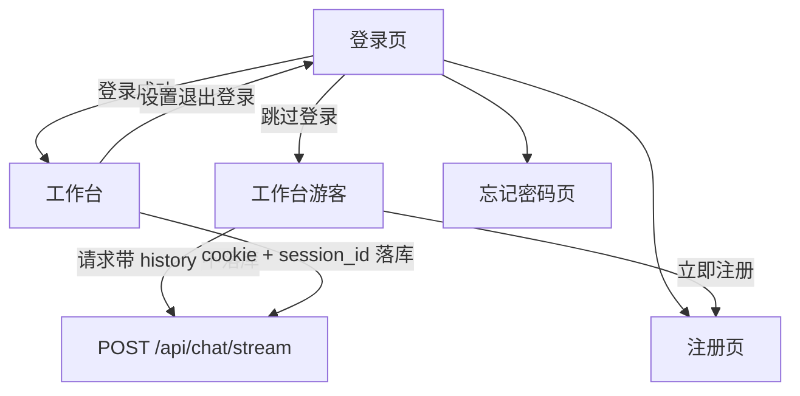

# 第 2 关：方案设计

**依据：** 修订后的 `01-requirements.md` 与 Figma（第 3 关）。本关不改业务代码。

---

## 范围

前后端都改。TravelState / SSE 事件名不变。新增鉴权 API 与会话归属。**UI 以独立鉴权页 + 工作台为准**，不再把登录表单塞进现有深色侧栏。

## 视图与路由

前端 `react-router-dom`，鉴权与工作台分页面（仍是同一个 Vite 入口 `web/`）：

| 路径 | 页面 |
|---|---|
| `/login` | 登录 |
| `/register` | 注册 |
| `/forgot` | 忘记密码（占位） |
| `/` | 会话工作台 |

- 未登录打开 `/` → 跳到 `/login`
- 「跳过登录」→ `/`（`location.state.guest`，刷新丢失后回到登录）
- 登录/注册成功 → `/`
- 退出 → `/login`
- 已登录访问鉴权页 → `/`

## 数据流

- **游客：** 消息只在 React state；请求带 `history`；不写 SQLite；不写 `localStorage` 会话 id。横幅可关闭（仅当前标签）。
- **已登录：** `sessions.user_id`；列表/历史仅本人。
- **游客登录/注册：** 不迁移气泡。

## 协议（确认后写入 DESIGN.md / itinerary.ts）

### User

`{ id: string; email: string; nickname: string }`  
`email` 字段存登录标识（邮箱或手机号字符串）。

### Cookie

`tp_auth`：httpOnly、SameSite=Lax、Path=/。`AUTH_SECRET` 在 `backend/.env`（不提交）。fetch 均 `credentials: "include"`。密码 `hashlib.pbkdf2_hmac`。

| 方法 | 路径 | 说明 |
|---|---|---|
| GET | `/api/auth/me` | `{ user: User \| null }` |
| POST | `/api/auth/register` | `{ nickname, email, password }`；成功 Set-Cookie；占用 409；校验失败 400 |
| POST | `/api/auth/login` | `{ email, password }`；错密 401 |
| POST | `/api/auth/logout` | 清 Cookie |
| POST | `/api/auth/forgot` | `{ email }`；**占位** 200 `{ ok: true, message }`，不发短信/邮件 |

### 会话

- 表 `users(id, email UNIQUE, nickname, password_hash, created_at)`
- `sessions.user_id` 仅登录行
- `ChatRequest.history?`：游客用，最多 20 条；已登录忽略客户端 history

SSE 不变。Planner 占位仍无按天 JSON。

## 前端（跟稿，CSS Module，禁止粘贴 Tailwind）

- 新页/组件：登录卡、注册卡、忘记密码卡（水彩背景图从 Figma asset 下载进 `web/src/assets/`）。
- 工作台按 `chat-screen-root` 改现有 `App`：浅色侧栏 280px、品牌「旅途知己」、新建会话、历史行程、底栏头像+昵称+设置。
- 游客工作台：历史空；底栏「游客」；顶栏横幅（规范 08）。
- 退出：设置触发器 → 下拉「退出登录」（规范 05）。
- testid：`login-view`、`register-view`、`forgot-view`、`workbench`、`guest-banner`、`skip-login`、`login-button`、`register-button`、`logout-button`、`auth-email`、`auth-password`、`auth-nickname`、`auth-password-confirm`、`forgot-submit`、`guest-badge`、`user-nickname`、`settings-trigger`。

色：主按钮 `#d65e47`，游客链接 `#6e8071`，纸色 `#fcfaf7` / `#f7f4ef`。

## 拟改文件

协议：`docs/DESIGN.md`、`docs/P0.md`、`web/src/types/itinerary.ts`  
后端：`user_store`、auth 路由、`session_store.py`、`chat.py`、`main.py`、`config.py`  
前端：鉴权视图、`App.tsx` / `App.module.css`、`api/auth.ts`、`chat.ts`、测试与 e2e  
覆盖：`AGENTS.md` 验收；`frontend-react.mdc`（auth API 模块）

## 测试

单测 mock fetch。e2e 拦 `/api/auth/*` 与现有 chat mock；覆盖登录页默认、跳过登录、注册/登录切换、游客横幅、退出。保留京都 Guide / 东京 5 日 / 新对话。

## 第 3 关基准

见 `output/03-baselines/`。第 7 关 pixelmatch 四页，视口 1400×920。
